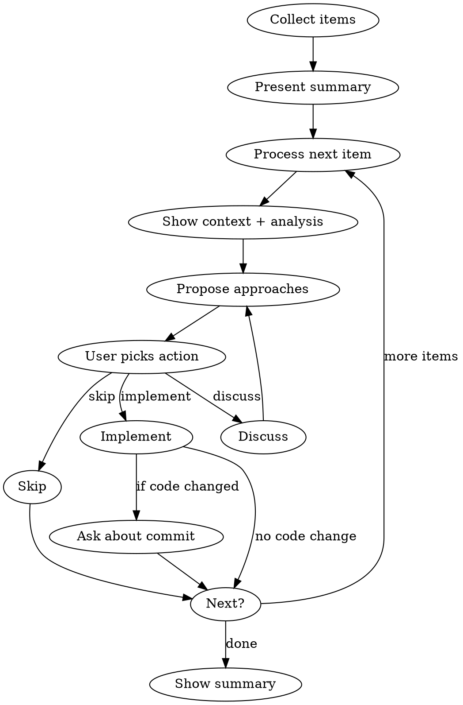

# Address Issues One by One

## Why this exists

Dumping multiple questions or decisions on a user all at once is overwhelming. Each item deserves its own context, analysis, and discussion. This skill enforces a sequential, interactive workflow: present one item, propose approaches, let the user decide (with discussion if needed), act on it, then move to the next.

## When to use this

- You have 2+ independent items that each need a user decision
- You're about to ask the user multiple questions at once — use this instead
- The user gives you a list of things to address (issues, TODOs, changes, review feedback)
- You identify multiple things that need attention (e.g., from reading code, a spec, or a plan)

## Process



## Step 1: Collect and present items

Gather all items into a numbered list. Show the user a brief summary before starting:

```
Found N items to address:
1. [short description]
2. [short description]
...

I'll go through them one at a time.
```

If the items come from your own analysis (e.g., questions you need answered), frame them clearly as decisions the user needs to make.

## Step 2: Process each item

For each item:

### 2a. Show context

Present ONE item per turn in plain text — never batch several items into one explanation
or one multi-question dialog. Batched prose gets skimmed past and the questions detach from
the item they belong to.

Give enough context for the user to make a decision:
- What the item is about
- Relevant code or files (read them first — don't propose changes to code you haven't read)
- Why it matters or what the impact is, plus your recommendation

Format: `**[N/total] item title or summary**` followed by context.

### 2b. Propose approaches

In the same turn, right after the explanation, present the decision as a SINGLE-question
AskUserQuestion. The dialog renders below your prose, so the explanation stays visible and
no separate acknowledgment turn is needed. Don't inline the options as prose ("implement /
skip / discuss?") — use the structured picker. Tailor options to the specific item — don't use a generic template.

**Always include:**
- One or more implementation/action options (mark the recommended one)
- "Skip" — move on without action
- "Discuss" — talk it through before deciding

Example:
```
1. Use a guard clause here (Recommended)
2. Extract to a helper method instead
3. Skip
4. Discuss
```

Keep options concise. If there's an obvious best choice, say why it's recommended in a short line before the options.

### 2c. Handle "Discuss"

If the user picks "Discuss": have a focused conversation about just this item. Explain trade-offs, ask what they're thinking, surface considerations they might have missed. When the discussion reaches a natural conclusion, re-present the options (potentially updated based on the discussion) so they can pick an action.

### 2d. Implement

If the user picks an action that involves changes:
1. Make the changes
2. If code was modified, ask whether to commit:
   ```
   AskUserQuestion: "Commit this change?"
   - Yes, commit: "[suggested commit message]"
   - Yes, with a different message
   - No, don't commit yet
   ```
3. If no code was modified (e.g., a decision was made, a question was answered), just note the outcome and move on.

### 2e. Skip

Note it was skipped and move to the next item. No judgment — skipping is a valid choice.

## Step 3: Summary

After all items are processed, show what happened:

```
Done — addressed N items:
- X implemented (Y committed)
- Z skipped
```

If there are uncommitted changes, mention it.

## Important principles

- **One at a time.** Never jump ahead or batch items together, even if they seem related. The user can always say "these next 3 are the same, just do them all" — but that's their call.
- **Read before proposing.** Always read relevant code/files before suggesting changes.
- **User decides.** Never implement without the user choosing an approach. The whole point is interactive decision-making.
- **Keep momentum.** Be concise in your analysis. The user wants to move through items efficiently, not read essays for each one.
- **Adapt the options.** Don't force-fit the same option structure on every item. A yes/no question needs two options, not five. A complex architectural decision might need several.
- **Explanation and picker in one turn, per item.** Write the plain-text explanation, then the single-question AskUserQuestion in the same turn — the prose stays visible above the dialog. Never inline options as prose instead of the picker, and never bundle multiple items or questions into one dialog.
