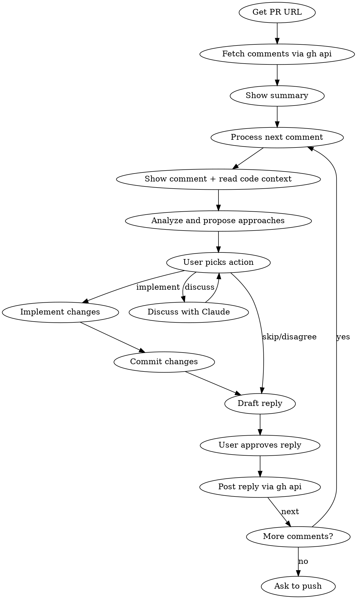

# Address PR Comments

## Overview

Interactive workflow for addressing GitHub PR review comments one by one. Fetches all comments, analyzes each with code context, proposes approaches, implements the chosen fix, commits atomically, and replies on GitHub.

## Process



## Step 1: Get PR URL

Accept PR URL as skill argument. If not provided, ask in plain text ("What's the PR URL?") and end the turn.

Extract owner, repo, and PR number from the URL.

## Step 2: Fetch Comments

Fetch both review comments (inline) and issue comments (general) using Bash with `gh api`:

```bash
# Inline review comments
gh api repos/{owner}/{repo}/pulls/{pr_number}/comments --paginate

# General PR comments
gh api repos/{owner}/{repo}/issues/{pr_number}/comments --paginate
```

**Important fields from review comments:**
- `id` — for replying
- `body` — comment text
- `path` — file path
- `line` / `original_line` — line number
- `diff_hunk` — code context
- `user.login` — author
- `in_reply_to_id` — thread parent (skip replies, only process root comments)
- `created_at` — for ordering

**Important fields from issue comments:**
- `id` — for replying
- `body` — comment text
- `user.login` — author
- `created_at` — for ordering

## Step 3: Present Summary

Show the user a summary before starting:

```
Found N comments on PR #123:
- X inline review comments (across Y files)
- Z general comments
```

Filter out:
- Bot comments (author login contains `[bot]`)
- The PR author's own comments (fetch PR to get author)
- Comments that are replies in a thread (only process root/parent comments — use `in_reply_to_id` field; skip comments where this is set)

Order: inline comments grouped by file path, then general comments.

## Step 4: Process Each Comment

For each comment:

### 4a. Show Context

One comment per turn — never batch several comments into one explanation or one dialog;
batched prose goes unread and the questions detach from their context.

Display, in plain text:
- Author and timestamp
- Comment body (full text)
- If inline: file path, line number, and the diff hunk
- Read the current version of the file around the relevant lines using the Read tool
- A plain-language explanation of what the comment means and what risk/improvement it points at, plus your recommendation

### 4b. Analyze and Propose

In the same message, right after the explanation, present the decision as a short numbered
list of options and END THE TURN — the user replies freeform (a number or words). Never use
`AskUserQuestion`: the interactive dialog swallows any explanation written before it, so the
user gets a bare choice with no context. Generate the options dynamically based on your analysis:

**Always include these base options:**
- "Skip" — acknowledge but make no code change
- "Disagree" — will draft a reply explaining why no change is needed
- "Discuss" — discuss this comment with Claude before deciding

**Add implementation options based on analysis:**
- For simple/clear suggestions: one "Implement: [description]" option
- For ambiguous suggestions: 2-3 different implementation approaches
- Mark recommended option with "(Recommended)" suffix

Example for a simple comment ("use guard clause here"):
```
1. Implement: refactor to guard clause (Recommended)
2. Skip
3. Disagree
4. Discuss
```

Example for an architectural comment ("consider extracting this to a service"):
```
1. Extract to a new service class (Recommended)
2. Extract to a concern/module instead
3. Skip
4. Disagree
5. Discuss
```

### 4c. Handle "Discuss"

If user picks "Discuss": have a conversation about the comment. Explain trade-offs, ask what they're thinking, help them decide. Then re-present the options so they can pick an action.

### 4d. Implement

If user picks an implementation option:
1. Make the code changes
2. Run relevant tests if obvious which ones apply
3. Stage and commit with a message like: `fix: [description of change] (PR comment by @author)`

### 4e. Handle Skip/Disagree

- **Skip**: No code changes, move to reply step
- **Disagree**: No code changes, move to reply step (reply will explain disagreement)

### 4f. Reply on GitHub

After handling the comment, show the drafted reply text in full and ask how to proceed, all in one turn-ending plain-text message (draft first, then the options — never `AskUserQuestion`):

**Generate reply options based on what happened:**

If code was changed:
- Option 1: Pre-drafted reply summarizing the change (e.g., "Fixed in [commit] — refactored to use guard clause as suggested")
- Option 2: Custom reply (user types their own)
- Option 3: No reply

If skipped:
- Option 1: Pre-drafted acknowledgment (e.g., "Acknowledged — will address in a follow-up")
- Option 2: Custom reply
- Option 3: No reply

If disagreed:
- Option 1: Pre-drafted respectful disagreement with reasoning
- Option 2: Custom reply
- Option 3: No reply

Post the reply on GitHub using `gh api`. **Do NOT use the GitHub MCP tools for replies — `add_reply_to_pull_request_comment` has a known bug (sends to wrong endpoint).**

```bash
# For inline review comments — reply in the review thread
# The endpoint is: POST /repos/{owner}/{repo}/pulls/{pull_number}/comments/{comment_id}/replies
# ALL THREE path segments (pulls number, comment id, and /replies) are required.
gh api repos/{owner}/{repo}/pulls/{pr_number}/comments/{comment_id}/replies -f body="reply text"

# For general PR comments (not inline review comments)
gh api repos/{owner}/{repo}/issues/{pr_number}/comments -f body="reply text"
```

## Step 5: Finish

After all comments are processed, show a summary of what was done:
```
Addressed N/M comments:
- X implemented (X commits)
- Y skipped
- Z disagreed
```

Then ask in the same turn-ending message: "Push commits to remote?"

If yes: `git push`

## Red Flags

- Processing comments without reading the actual current code first
- Committing without the user choosing an approach
- Replying on GitHub without user approval of the reply text
- Skipping the summary at the end
- Auto-resolving comment threads (never do this)

## Common Mistakes

| Mistake | Fix |
|---------|-----|
| Replying to thread replies instead of root comments | Filter by `in_reply_to_id` being null |
| Missing pagination on large PRs | Always use `--paginate` with `gh api` |
| Committing multiple comments in one commit | One commit per comment, always |
| Not reading current file state | Always Read the file before proposing changes |
| Posting reply before user approves text | Always show the draft and get an explicit go-ahead first |
| Batching several comments into one explanation | One comment per turn: plain-text explanation, then numbered options, end the turn |
| Using `AskUserQuestion` for any decision | The dialog swallows preceding prose in the user's client — always plain-text numbered options ending the turn |
