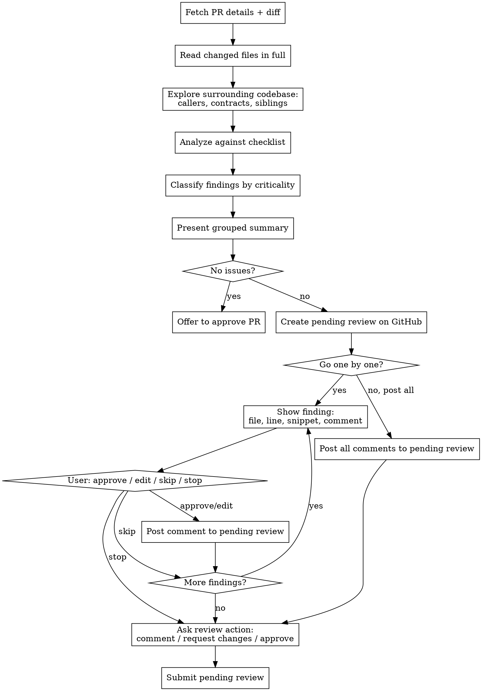

# Assisted Code Review

## Overview

Structured PR review: fetch diff, analyze in full context, classify findings by criticality, present summary, walk through each finding for user approval, post comments incrementally to a pending GitHub review, then submit.

**NEVER post comments on GitHub without explicit user approval for each one.**

## Workflow



## Step 1: Fetch PR

Accept PR URL or number. If not provided, ask via AskUserQuestion.

```bash
# PR metadata
gh pr view <number> --json title,body,author,baseRefName,headRefName,additions,deletions,changedFiles,files

# Full diff
gh pr diff <number>
```

Also read CLAUDE.md if present for project-specific conventions to check against.

## Step 2: Analyze

**Read every changed file in full** (not just diff hunks) to understand surrounding context.

### Explore beyond the diff

The diff and changed files alone can't answer the Ripple Effects, Deployability, Architecture, or Conventions questions below — those require looking at code the PR *doesn't* touch. Before judging, explore enough to answer them for these specific changes:

- **Callers & consumers** — grep for every changed public symbol, route, job, event name, or JSON/queue shape. Trace at least one level of dependents.
- **Lingering references** — for renamed/removed symbols, confirm nothing still calls the old path.
- **Conventions & duplication** — find 1-2 sibling implementations of the same pattern to calibrate "is this consistent / is this already solved elsewhere."

Scope it to what these changes touch — don't read the whole repo. For large PRs, dispatch parallel explore agents instead of searching serially.

### Review Checklist

**Correctness:**
- Logic errors, bugs, off-by-ones?
- Edge cases handled (nil, empty, boundary)?
- Error handling present and correct?

**Silent Failures:**
- Bare `rescue` / `rescue => e` that swallow exceptions — even with Sentry reporting, a rescue-all needs justification (a comment explaining *why* it's catching broadly). Without that context, flag it.
- Empty `rescue` blocks — always flag
- `rescue` returning a default value (nil, [], {}) that masks real errors
- Callbacks or jobs that fail without logging or alerting
- `find_by` where `find` would be more appropriate for required records

**Security:**
- Injection vectors (SQL, XSS, command)?
- Auth/authz bypass?
- Data exposure, secrets in code?

**Performance:**
- N+1 queries, missing indexes?
- Unnecessary allocations, redundant work?
- Scalability concerns?

**Architecture:**
- Sound design decisions?
- Separation of concerns?
- DRY without premature abstraction?

**Testing:**
- Are changes tested?
- Edge cases covered?
- Assertions meaningful (not just "no error")?

**Ripple Effects (2nd/3rd order consequences):**
- What else in the codebase depends on the changed code?
- Could this change break callers, consumers, or downstream systems?
- Are there implicit contracts (event names, JSON shapes, queue messages) that changed?
- If a model changed, what jobs, services, or integrations touch it?

**Deployability & Backwards Compatibility:**
- Does this need a migration? If so, is it safe to run with the old code still serving traffic?
- New columns: do existing records need backfilling? Is a data migration needed?
- Renamed/removed columns or methods: is the old code path still referenced anywhere?
- Feature flags needed for safe rollout?
- Environment variables, configs, or external dependencies that must exist before deploy?

**Conventions:**
- Project rules from CLAUDE.md followed?
- Naming, style, patterns consistent with codebase?

### For Each Finding

Every finding MUST include:
1. **File and line** — exact location
2. **What's wrong** — the specific issue
3. **Why it matters** — impact if not fixed
4. **Suggested fix** — actionable, use GitHub suggestion blocks when proposing specific code changes

## Step 3: Classify and Present

### Criticality Levels

| Level | Meaning | Examples |
|-------|---------|----------|
| Critical | Must fix before merge | Security holes, data loss, crashes, broken functionality |
| Important | Should fix before merge | Logic errors, missing edge cases, perf regressions, test gaps |
| Minor | Nice to fix | Style issues, naming, minor refactors |
| Nit | Optional, take or leave | Cosmetic, personal preference, tiny improvements |

### Presentation Format

Start with strengths (what's well done), then findings:

```
## PR #123: "Title" by @author

### Strengths
- Clean separation of concerns in the new service layer
- Good test coverage for the happy path

### Critical (N)
1. [app/models/user.rb:45] SQL injection — user input interpolated directly into query
   → Use parameterized query instead

### Important (N)
2. [app/services/notifier.rb:23] Missing nil check — crashes if user.email is nil
   → Add guard clause or validate presence
3. [test/controllers/notifications_test.rb] No test for the error path
   → Add test for when notification delivery fails

### Minor (N)
4. [app/models/notification.rb:12] `send_notif` → `send_notification` per project naming

### Nit (N)
5. [app/views/notifications/show.json.jbuilder:8] Trailing whitespace

---
Totals: N critical, N important, N minor, N nit

**Ready to merge?** Yes / With fixes / No
**Reasoning:** [1-2 sentence technical assessment]
```

If no issues found, say "PR looks clean" and offer to post an approval.

## Step 4: Create Pending Review and Post Comments

### Create the pending review

Try the MCP tool first. If it fails (e.g., repo resolution error), fall back to the REST API:

**MCP (try first):**
```
pull_request_review_write:
  method: "create"
  owner: {owner}
  repo: {repo}
  pullNumber: {number}
  # No event — creates a pending (draft) review
```

**REST fallback:**
```bash
gh api repos/{owner}/{repo}/pulls/{number}/reviews --method POST -f body=""
```

Save the review's `node_id` (e.g., `PRR_kw...`) from the response — you'll need it for GraphQL mutations.

Then ask via AskUserQuestion: **"Want to go through these one by one before I post the review?"**

### If Yes — Interactive Flow

Process each finding, ordered by criticality (critical first). For each:

1. Show: file path, line number, code snippet from the diff, and proposed GitHub comment text
2. Ask via AskUserQuestion with options:
   - **Approve** — post this comment to the pending review immediately
   - **Edit** — user provides modified comment text; show updated version, confirm, then post
   - **Skip** — exclude from review, move to next
   - **Stop** — halt here, move to submitting what's been posted so far

When user approves or edits, post the comment immediately.

**MCP (try first):**
```
add_comment_to_pending_review:
  owner: {owner}
  repo: {repo}
  pullNumber: {number}
  path: "app/models/user.rb"
  line: 45
  side: "RIGHT"
  body: "Comment text"
  subjectType: "LINE"
```

**GraphQL fallback — use `addPullRequestReviewThread`:**
```bash
gh api graphql -f query='
mutation {
  addPullRequestReviewThread(input: {
    pullRequestReviewId: "{review_node_id}",
    path: "app/models/user.rb",
    line: 45,
    side: RIGHT,
    body: "Comment text"
  }) {
    thread { id }
  }
}'
```

> **WARNING:** The REST endpoint `POST /repos/.../pulls/.../comments` does NOT accept `line`/`side`/`subject_type` fields.
> The GraphQL mutation `addPullRequestReviewComment` also does NOT accept `line`/`side`.
> Only `addPullRequestReviewThread` works for line-level comments on a pending review.

### If No — Post All

Post all comments to the pending review at once using the same approach (MCP or GraphQL fallback) for each finding.

### Field Notes

- `side`: `RIGHT` for new/modified lines (almost always), `LEFT` for deleted lines
- `line`: line number in the new file version (`RIGHT`) or old file version (`LEFT`); must be within a diff hunk
- For multi-line comments, also pass `startLine` and `startSide`
- For code suggestions, use GitHub's suggestion syntax in the body: ` ```suggestion\ncorrected code\n``` `
- Escape single quotes in `gh api graphql` shell commands (use `'\''` inside single-quoted strings)

## Step 5: Submit Review

After all comments are posted (or user says stop), ask via AskUserQuestion what review action to set:
- **Comment** — neutral feedback, non-blocking
- **Request changes** — blocking review
- **Approve** — with optional notes

**MCP (try first):**
```
pull_request_review_write:
  method: "submit_pending"
  owner: {owner}
  repo: {repo}
  pullNumber: {number}
  event: "REQUEST_CHANGES"  # or "COMMENT" or "APPROVE"
  body: "Review summary — N comments across M files"
```

**GraphQL fallback:**
```bash
gh api graphql -f query='
mutation {
  submitPullRequestReview(input: {
    pullRequestReviewId: "{review_node_id}",
    event: COMMENT,
    body: "Review summary — N comments across M files"
  }) {
    pullRequestReview { id state }
  }
}'
```

Valid events: `COMMENT`, `REQUEST_CHANGES`, `APPROVE`.

If something goes wrong and you need to discard the review, use MCP `method: "delete_pending"` or:
```bash
gh api graphql -f query='
mutation {
  deletePullRequestReview(input: {
    pullRequestReviewId: "{review_node_id}"
  }) { pullRequestReview { id } }
}'
```

## Comment Tone

GitHub comments are posted under the user's name. Keep them:
- **Constructive** — suggest improvements, don't lecture
- **Concise** — one paragraph max per comment, plus optional suggestion block
- **Framed as questions when subjective** — "Would it be cleaner to...?" vs "You should..."
- **Direct when objective** — "This is a SQL injection vector" doesn't need softening

## Red Flags

| If you're about to... | STOP |
|---|---|
| Post without user approving each comment | Never — approval is mandatory |
| Read only diff hunks, not full files | Read full files for surrounding context |
| Classify a security issue below Critical | Security issues are always Critical |
| Skip the summary | Always show classified overview first |
| Submit review before user chooses the action | Always ask: comment, request changes, or approve |
| Write vague comments | Be specific: file, line, what, why, fix |
| Skip mentioning strengths | Always acknowledge what's well done |
| Ignore deployment implications | Always check if migration/backfill/config is needed |
| Skip ripple effect analysis | Check what depends on changed code |

## Common Mistakes

| Mistake | Fix |
|---------|-----|
| Only reading diff context | Read full changed files for surrounding context |
| Vague "improve error handling" | Specify exactly what error, where, and how to handle it |
| Everything is Critical | Calibrate — use Important/Minor/Nit honestly |
| No review action prompt | Always ask: comment, request changes, or approve |
| Missing code suggestions | Use ` ```suggestion ` blocks for concrete fixes |
| Forgetting to ask about strengths | Good review = balanced; acknowledge quality work |
