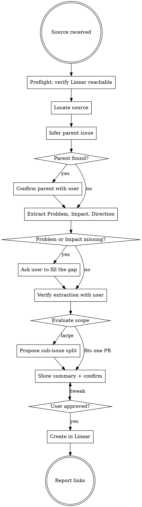

# Create Linear Issue

## Overview

Persist work as a Linear issue focused on **Why** (the problem) and **Impact** (the outcome). The **How** — the solution direction — is left as a placeholder for whoever picks the issue up, unless session context already makes the direction clear.

**This is a problem-framing skill, not a solution-design skill.** The issue describes work in terms of what's broken or absent, who feels it, and what changes once it ships. Design decisions, edge cases, acceptance criteria, and step-by-step plans belong to the implementer, not the ticket.

**No code, no branches, no PRs.** This skill only writes Linear issues; it does not implement them.

**Announce at start:** "Using create-linear-issue to turn this into a Linear issue."

## Process Flow



## Step 0: Preflight

Resolve the ENG team's UUID — needed for `save_issue` in Step 6. The UUID is stable, so cache it across sessions in a project-scoped file under Claude's existing per-project directory (next to the `memory/` subdir Claude already maintains there).

Derive the cache path (worktree-safe; encodes the main repo path even when invoked from `.worktrees/<branch>/`, so all worktrees of the same repo share one cache):

```bash
repo_root=$(cd "$(git rev-parse --git-common-dir)/.." && pwd)
encoded=$(printf '%s' "$repo_root" | sed 's|/|-|g')   # matches Claude's project-dir encoding
cache_file="$HOME/.claude/projects/$encoded/cache/linear-eng-team-id"
```

**If `$cache_file` exists**, read the team_id from it and proceed to Step 1. **Skip `list_teams` entirely** — Linear unreachability will surface naturally if `save_issue` later fails, and the saved MCP call compounds across invocations.

**If `$cache_file` doesn't exist**, fetch and cache:

```
ToolSearch(query: "+linear list_teams")
mcp__*_Linear__list_teams()
```

If the call fails (auth error, server disconnected, tool not found), stop the skill and tell the user: "Linear MCP isn't reachable — connect it in your MCP settings and retry." Do not attempt any of the later steps; they all depend on Linear writes.

If the call succeeds, find the team named `ENG` in the response, extract its `id`, and persist it:

```bash
mkdir -p "$(dirname "$cache_file")" && printf '%s\n' "<team_id>" > "$cache_file"
```

**Cache invalidation:** if a later Linear write returns "team not found" (or similar) with the cached ID, `rm "$cache_file"` and rerun this step. Rare — the ENG team's UUID doesn't change unless the team is renamed or recreated in Linear.

## Step 1: Locate the source

The source for the issue can arrive several ways:

- **File path argument** — a `.md` or `.txt` plan, spec, or notes file. Read with `Read`.
- **Conversation context** — the work was described earlier in chat.
- **Direct user prompt** — the user describes the work in the message that invoked the skill.

Arguments may arrive in any order. Identify each by shape, not position: a file path is a file path; an `ENG-<N>` or Linear URL is a parent candidate (Step 2).

If nothing usable is provided (no file arg, no plan content in recent conversation, no described work), stop and ask the user to provide one — a path, a paste, or "use what I wrote above." Don't fabricate a problem from vibes.

Read carefully — the goal of every later step is to faithfully extract the **Problem** and **Impact** from this source.

## Step 2: Infer parent issue

Check these signals in order and stop at the first hit:

1. **Source explicitly references a Linear issue** (e.g., "part of ENG-286", "per ENG-123's spec")
2. **An arg looks like a Linear URL or `ENG-<N>` identifier** — use directly
3. **Current git branch matches `<prefix>/ENG-<N>-...`** — run `git branch --show-current` to check
4. **Recent conversation mentions a Linear issue ID** in a way that implies this work belongs under it
5. **The source reads like a piece of a larger initiative** — phrases like "as part of", "step toward", "building on", "first of several", or a narrow scope that clearly implies a broader effort (e.g., "add the webhook endpoint" when no broader "Gorgias integration" context is given). This is softer than signals 1-4, but strong enough to warrant a question.

**For strong signals (1-4)**, fetch the candidate via `mcp__*_Linear__get_issue(issue_id: "ENG-<N>")` to confirm it exists and pull its title, then ask the user with a 2-option form (`Yes` / `No, top-level`).

**For weak signals (5) — or if the source's scope feels too narrow to stand alone —** search Linear first and present candidates:

```
mcp__*_Linear__list_issues(query: "<relevant keywords from source>", team_id: "<ENG team_id>", limit: 5)
```

Either way, the question is one `AskUserQuestion`. The weak-signal form (more options) looks like this; for strong signals, drop `Different parent` and simplify the labels:

```
AskUserQuestion(questions: [{
  question: "This reads like part of a larger effort. Pick a parent?",
  header: "Parent?",
  multiSelect: false,
  options: [
    { label: "ENG-<N>: <title>", description: "Nest under this candidate" },
    { label: "Different parent", description: "I'll paste the URL/ID" },
    { label: "Top-level", description: "No parent, create standalone" }
  ]
}])
```

If no candidate is found and the source reads as a self-contained effort (signal 5 does not fire), default to top-level with no question — just note "No parent inferred; creating top-level." and continue.

## Step 3: Extract Problem, Impact, and (optional) Direction; then verify

Split the source content into three buckets. The first two are **required content** for the issue; the third is **optional**.

- **Problem** — what's broken, missing, or painful today. Who feels it, when it bites, what the cost is. This is the **Why**.
- **Impact** — what becomes possible or better once this ships. Who benefits, how we'd recognize the improvement. This is the **outcome**, not the solution.
- **Direction (optional)** — only if the source clearly states a chosen approach or the session conversation already settled on one. One paragraph max, capturing the direction (not step-by-step plans, not multi-option discussions, not design decisions). If nothing's been decided, leave it empty and the issue gets a placeholder.

**If the source is silent on Problem or Impact, ask the user to fill the gap.** The implementer needs this load-bearing context to judge edge cases when the spec is silent — letting it slip through wastes their first hour. A short, focused question is enough; don't drag the user through a workshop.

**If the source contains design decisions, multi-option discussions, edge cases, acceptance criteria, or implementation steps, drop them.** Briefly tell the user what you dropped so they're not surprised the issue is shorter than the source. The implementer rediscovers what's relevant once they pick a direction.

Present the extraction and ask for verification in a single plain-text message that **ends your turn** — do NOT use `AskUserQuestion` here, and do NOT put the extraction in the same turn as any tool call (see "Content-bearing confirmations" in Common Mistakes):

```
Here's what I extracted:

**Problem**
<brief and concise paragraph>

**Impact**
<brief and concise paragraph>

**Direction** (optional)
<1 paragraph, or "Leaving as TBD placeholder">

Dropped from the source (belongs in How, owned by the implementer):
- <design decision the source made>
- <multi-option discussion>
- <step-by-step plan or edge case>

Does this match? Reply "looks right" to continue, ask for the source quotes behind any bullet, or tell me what to change.
```

If nothing was dropped, omit that block.

The verification is a sanity check, **not** a walk-through. If the user asks for quotes, re-present the extraction with the supporting source line(s) under each bullet (or `(your hint, not in source)` for items the user filled in during the gap-fill prompt), ending the turn the same way. Proceed to Step 4 only on an affirmative reply; fold any correction in and re-present.


## Step 4: Evaluate scope

Evaluate whether to split. Propose a split if any of these apply:

- 3+ independent problem/impact areas with separable deliverables
- Natural dependency layers (e.g., a foundation piece that must land before a downstream one can start)
- Two or more separable business milestones that could each ship independently

**If a split is warranted**, present the proposal and the question together in one plain-text message that **ends your turn** — no `AskUserQuestion`, no tool calls in the same turn:

```
This is large enough to split into smaller issues:

1. **<sub-title-1>** — <what it accomplishes, in business terms>
2. **<sub-title-2>** — <what it accomplishes> (blocked by #1)
3. **<sub-title-3>** — <what it accomplishes> (parallel to #2)

Dependencies: #2 depends on #1 because <reason>. #3 is independent.

Split it this way (recommended), keep it as one issue, or tell me how you'd cut it differently.
```

Proceed only once the user has answered.

If a split isn't warranted, skip this step entirely — don't create noise by asking about splits that don't make sense.

When splitting: the **Problem** and **Impact** on the parent describe the overall effort. Each sub-issue gets its own scoped Problem and Impact for the slice it owns.

## Step 5: Show summary and confirm

Before any Linear write, show a **compact summary** of what will be created — not the full rendered markdown. The goal here is to catch big mistakes (wrong title, wrong parent, missing sub-issue, wrong dependency), not to proof-read every line. Anything else can be refined in Linear after creation or by telling the skill what to change.

**For a single issue**, show:

```
**Title:** <title>
**Problem (1-liner):** <single sentence capturing the why>
**Impact (1-liner):** <single sentence capturing the outcome>
**Parent:** <ENG-N: title, or "none">
```

**For a split**, show the parent block followed by a sub-issue list:

```
**Parent title:** <title>
**Problem (1-liner):** <single sentence>
**Impact (1-liner):** <single sentence>

**Sub-issues:**
1. <title> — <one-line summary>
2. <title> — <one-line summary> (blocked by #1)
3. <title> — <one-line summary> (parallel to #2)
```

End the summary message with the confirmation question, in the same turn-ending plain-text message — no `AskUserQuestion`:

```
Create these in Linear? Reply "create" to write them now, "show markdown" to preview the full rendered bodies first, or tell me what to tweak.
```

If the user asks for the markdown, render the full description(s) — for a single issue, the body using the template from Step 6; for a split, the parent body followed by each sub-issue body — and end the turn asking for confirmation again.

**The Linear write is hard-gated on an explicit affirmative reply.** Never create issues off an ambiguous response; when in doubt, ask again.

**Conciseness rules for the descriptions you'll write in Step 6:**

- **Problem:** a brief and concise paragraph. Concrete: what's broken/absent, who feels it, when it bites. No solution language.
- **Impact:** a brief and concise paragraph. What changes once this ships — for users, ops, the business, the system. Not a list of system behaviors (that's How content).
- **How:** placeholder by default. One paragraph max if the direction is already decided. **Never** a step-by-step plan, even if the source provided one.

## Step 6: Create in Linear

Resolve defaults once at the start of this step:

- **Team:** ENG — use the `team_id` cached in Step 0.
- **Assignee:** leave unassigned. The author can find the issue via Linear's "Created by me" filter, and the implementer self-assigns when they pick it up. Do not attempt to resolve or infer the assignee in this skill.
- **Status:** leave unset — Linear uses the team's default (backlog).
- **Priority:** only set if the source or the user specified one. Don't guess.
- **Labels:** only set if the source or the user specified them. Don't guess.

Load the save tool:

```
ToolSearch(query: "+linear save_issue")
```

### Description templates

Apply the conciseness rules from Step 5.

**Parent / single-issue template:**

```
## Problem
<brief and concise paragraph: what's broken, missing, or painful today; who feels it; when it bites>

## Impact
<brief and concise paragraph: what becomes possible/better once this ships; who benefits; how we'd recognize success>

## How
_TBD — fill in once a direction is chosen._
```

If the session has clearly decided a direction, replace the placeholder with **one paragraph** (max) stating the direction — not a step-by-step plan, not a list of design decisions, just the chosen path. Anything more belongs in PR description, code review, or a follow-up plan doc.

**Do not list sub-issues in the parent description.** Linear renders the parent/child relationship in its UI — listing them in the body duplicates that, goes stale the moment anyone reorders/renames/adds a sub-issue, and adds noise.

**Sub-issue template (required when splitting):**

```
## Big Picture
<parent-issue-id> aims to <1-2 sentence summary of the overall goal>. This sub-issue covers <where this piece fits>.

## Problem
<brief and concise paragraph: the slice of the broader problem this sub-issue addresses>

## Impact
<brief and concise paragraph: what this specific sub-issue makes possible/better>

## How
_TBD — fill in once a direction is chosen._
```

The Big Picture section is load-bearing: someone opening a sub-issue cold needs the overall goal to make sense of the slice.

### Single issue (or parent of a split)

```
mcp__*_Linear__save_issue(
  title: "<issue title>",
  description: "<markdown body using the template above>",
  team_id: "<ENG team_id>",
  parent_id: "<parent-issue-uuid>"   // only if Step 2 identified a parent
)
```

### Each sub-issue (when splitting)

```
mcp__*_Linear__save_issue(
  title: "<sub-issue title>",
  description: "<markdown body using the sub-issue template>",
  team_id: "<ENG team_id>",
  parent_id: "<newly-created parent uuid>"
)
```

### Blocker relations

After creating all sub-issues, set blocker relations for real dependencies:

```
mcp__*_Linear__save_issue(
  id: "<blocked-sub-issue-uuid>",
  relation: { type: "blocks", issue_id: "<blocking-sub-issue-uuid>" }
)
```

Only add relations where a real dependency exists — don't serialize work that could run in parallel.

### Important: pass raw newlines

Per the Linear MCP instructions, send real newlines in markdown content, not literal `\n` escape sequences. If you're constructing the description by string concatenation in your head, just make sure the tool receives proper newline characters.

## Step 7: Report to the user

Summarize:

- Issue URL(s) with titles
- Parent linkage (if any)
- Blocker relations created (if any)

End with a one-liner that offers both ways to iterate: "Refine directly in Linear if you want, or tell me what to tweak and I'll update via `save_issue`." If the user replies with feedback — description changes, title tweaks, adding labels, splitting further, filling in the How section, etc. — apply it by calling `save_issue` with the existing issue `id`, not by creating a new issue.

## Quick Reference

| Step | Tools | Output |
|------|-------|--------|
| 0. Preflight | Linear `list_teams` | Auth verified, ENG `team_id` cached |
| 1. Locate source | `Read` (if file) | Raw source content |
| 2. Infer parent | `git branch --show-current`, Linear `get_issue`/`list_issues` | Parent candidate (or none) |
| 3. Extract & verify | turn-ending text, freeform reply | Problem + Impact + optional Direction, user-confirmed |
| 4. Scope | turn-ending text, freeform reply (only if split warranted) | Split or keep |
| 5. Summary + confirm | turn-ending text, freeform reply | Go/tweak |
| 6. Create | Linear MCP `save_issue` | Issue(s) + blocker relations |
| 7. Report | — | Links |

## Common Mistakes

### Filling in How with the source's solution detail
- **Problem:** Source had design decisions, multi-option discussions, or a step-by-step plan, and they got copied into the How section. Now the implementer feels constrained to follow them even if a better direction exists.
- **Fix:** How is a placeholder by default. Fill it only when the session has clearly chosen a direction, and even then keep it to one paragraph stating the direction — never a plan.

### Conflating Impact with Acceptance Criteria
- **Problem:** Impact reads like a checklist of behaviors the system should exhibit. That's solution, not outcome.
- **Fix:** Impact answers "what changes for users / ops / the business?", not "what does the system do?". If you find yourself listing system behaviors, you're in How territory — drop them.

### Skipping Problem because the source jumped straight to solutions
- **Problem:** Source was a design doc that didn't explicitly state the problem, and you let the issue ship without one.
- **Fix:** Ask the user. Problem is load-bearing — the implementer needs it to judge edge cases when the spec is silent. A short question is enough; don't drag the user through a workshop.

### Content-bearing confirmations via `AskUserQuestion`
- **Problem:** Text emitted in the same turn as a tool call is not reliably rendered (the VSCode extension drops it), so "print the draft, then call `AskUserQuestion`" shows the user a bare Yes/No dialog with no draft to judge. And the drafts (extraction, split proposal, summary) are far too long for the `question` field or option labels/previews.
- **Fix:** Steps 3, 4, and 5 never use `AskUserQuestion`. Present the content AND the question in one plain-text message that ends the turn; the user replies freeform. Reserve `AskUserQuestion` for short, self-contained choices where the option labels carry all the context (Step 2 parent picking).

### Listing sub-issues in the parent description
- **Problem:** Writing a "Sub-issues" section (or bulleted links) into the parent body. Linear already shows the hierarchy in its UI, so the list is redundant, and it goes stale the moment the split changes.
- **Fix:** Let Linear's parent/child relationship speak for itself. Don't enumerate sub-issues in the parent description.

### Missing that the work is a piece of a bigger picture
- **Problem:** Creating a top-level issue for work that clearly belongs under an existing initiative scrambles the Linear hierarchy. Signals 1-4 (explicit reference, arg, branch, conversation) catch the obvious cases, but a narrow-scoped source with no explicit parent reference can still be a sub-piece of something larger.
- **Fix:** Read the source's scope critically. If it sounds like "a piece" rather than "a whole thing", search Linear for candidates and ask.

### Confirming parent when inference is strong, or failing to when it's weak
- **Problem:** Asking about a clear parent wastes a turn; assuming parent from a stale branch creates wrong hierarchy.
- **Fix:** For strong signals (explicit ID, matching branch, direct conversation reference), confirm once and move on. For weak signals (source-content-only hints), search and ask.

### Calling Linear tools before ToolSearch
- **Problem:** The Linear MCP tools are deferred and will fail with `InputValidationError` until loaded.
- **Fix:** Always `ToolSearch(query: "+linear <verb>")` before using a Linear tool for the first time in the session.

## Red Flags

**Never:**
- Write code, create branches, run tests, or edit files outside `.claude/`
- Overwrite the source file
- Copy design decisions, edge cases, acceptance criteria, or step-by-step plans into the issue
- Invent a Problem or Impact the source didn't state (ask the user instead)
- Fill How beyond a one-paragraph direction, even if the source had more detail
- Create issues without showing the summary block and getting confirmation
- Guess at priority, labels, or an assignee (leave unassigned)

**Always:**
- Lead with Problem and Impact; leave How as `_TBD — fill in once a direction is chosen._` unless the direction is clearly decided
- Tell the user what you dropped from the source (so they know the issue is intentionally shorter)
- Show a compact title-and-summary block and get confirmation before creating
- Auto-suggest splits when scope warrants
- Include a Big Picture section in every sub-issue
- Set blocker relations for real dependencies
- Remind the user at the end that they can refine in Linear themselves OR tell you what to change (you'll edit via `save_issue` with the existing `id`)
